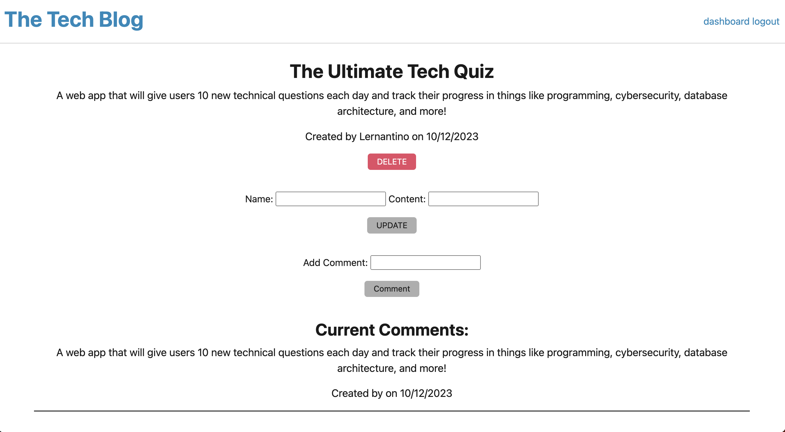

# Tech_Blog_App

## Description

This code creates a Tech Blog App. Users can view posts from all users. Users can log in and create their own posts as well as comment on others blogs. The option to delete or update your own posts is also available.

## Installation

N/A

## Usage

[Link to Landing Page](https://akleynhans.github.io/Tech_Blog_App/)

 
Homepage

 
Login page

 
User dashboard

 
Blog post options

## Credits

[link to model querying](https://sequelize.org/docs/v6/core-concepts/model-querying-basics/) 

